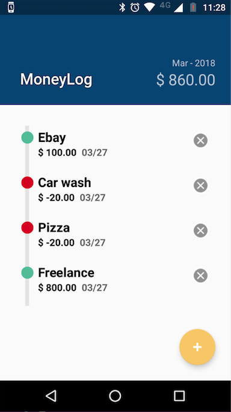
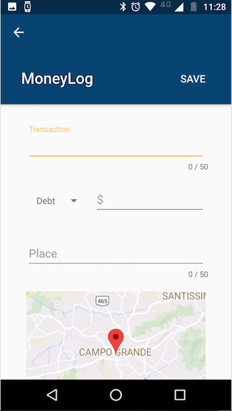
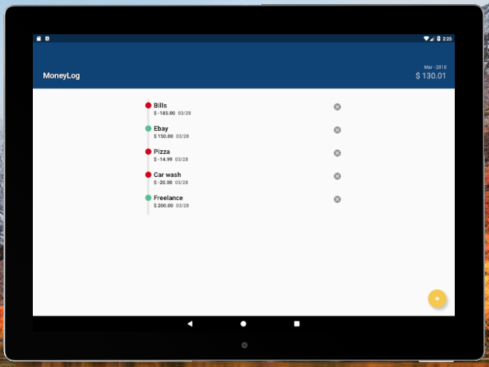
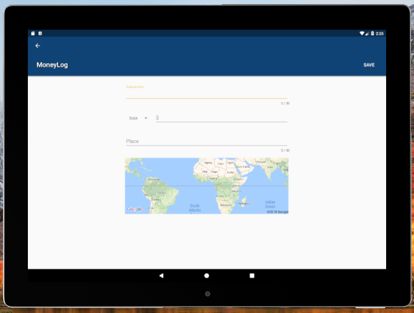
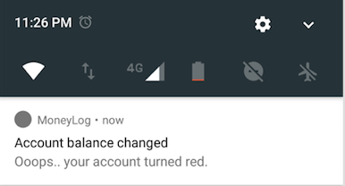
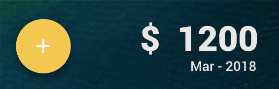
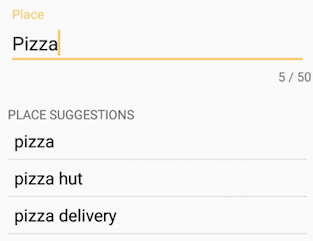

<h1 align="center">
   
  
   
  MoneyLog
   
   
</h1>

<h4 align="center"> Udacity Capstone Project </h4>

### Running

This project was built using Android Studio 2.3.2 and Gradle 3.0.1
All dependencies are listed at build.gradle.

In order to run this application you'll need to have two keys from Google APIs:

* *Google Maps Android API*: It should be restricted to the package _com.moneylog.android.moneylog_, as an Android Apps and API restrictions setted to Google Maps Android API. Once you get the API Key, you should place it in the *config_google_maps_key* entry, on the strings.xml file.

* *Google Places API Web Service*: It should be restricted to the package _com.moneylog.android.moneylog_, as an Android Apps and API restrictions setted to Google Places API Web Service. Once you get the API Key, you should place it in the *config_google_places_key* entry, on the strings.xml file.

### Capstone Stage 1 Specs

The *Capstone_Stage1.pdf* file is located under _/docs_ dir.

### Screenshots

| Phone - Transactions | Phone - Add Transaction |
|---|---|
|  |  |

| Tablet - Transactions | 
|---|
|  | 

| Tablet - Add Transaction | 
|---|
|  | 

| Notification | Home Screen Widget |
|---|---|
|  |  |

| Google Places Suggestions |
|---|
|  |
